# CSS Positioning Lab

> Focus: core positioning modes (`relative`, `absolute`, `fixed`, `sticky`) and layering. Do **not** change HTML. Only edit `task.css`.
>
> Dates: (fill in when delivered)

---

## 🟢 Core Tasks

1. Relative Offset – Move the middle blue box 20px down, 10px right.
2. Absolute Child – Put the yellow circle at the container's bottom-right corner.
3. Fixed Bar – Make the nav bar stick to top of the viewport.
4. Layer Stack – Overlap boxes: green on top, red middle, blue bottom (use z-index).
5. Modal Overlay – Full-screen overlay covering viewport.
6. Sticky Header – Header sticks inside its scroll area (`top:0`).
7. Notification Badge – Badge outside top-right of icon (negative offset).
8. In-Container FAB – FAB 20px from bottom-right of its scrollable demo; menu appears above.
9. Tooltip – Tooltip 10px below button, centered; arrow points upward.
10. Dropdown Menu – Main menu below trigger; submenus open to the right.
11. Page FAB – FAB fixed to viewport bottom-right (not container).
12. Human Figure (Bonus) – Assemble parts with absolute positioning & transforms.

---

## 🎯 Target Output

Below are the reference images showing what your solution should look like:

|  Task 1: Relative Positioning   |  Task 2: Absolute Positioning   |    Task 3: Fixed Positioning    |
| :-----------------------------: | :-----------------------------: | :-----------------------------: |
| 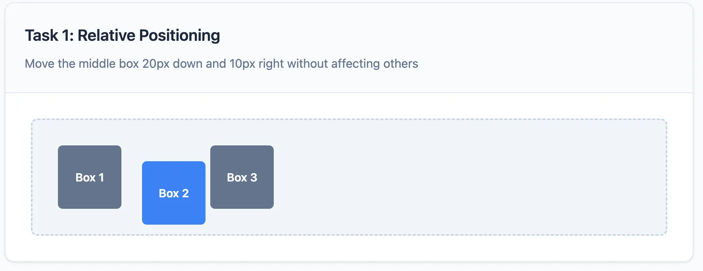 | 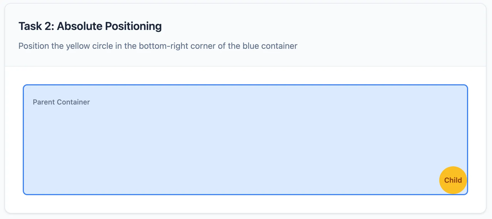 | 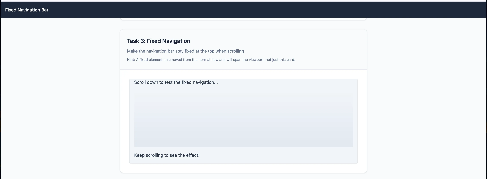 |

|    Task 4: Z-Index Stacking     |      Task 5: Modal Overlay      |   Task 6: Sticky Positioning    |
| :-----------------------------: | :-----------------------------: | :-----------------------------: |
| 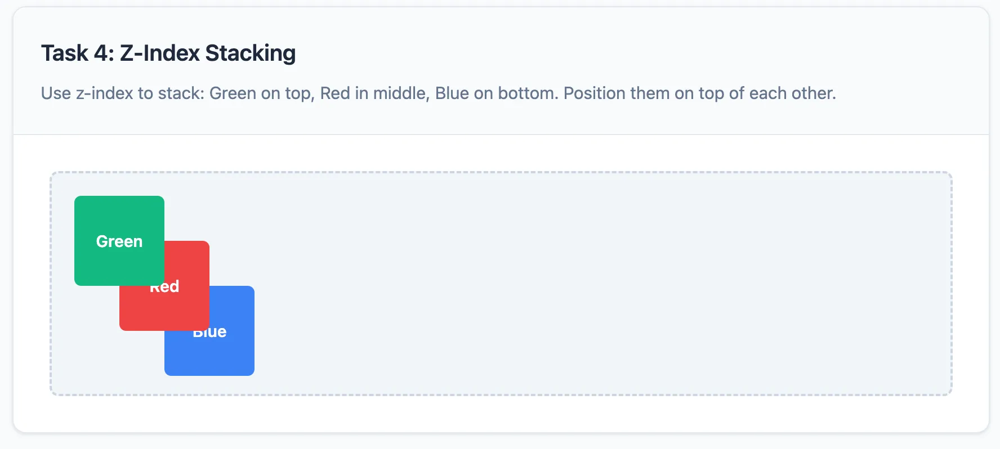 | 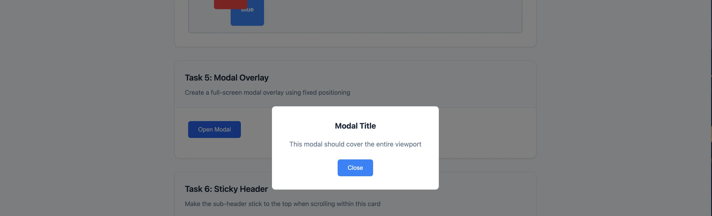 | 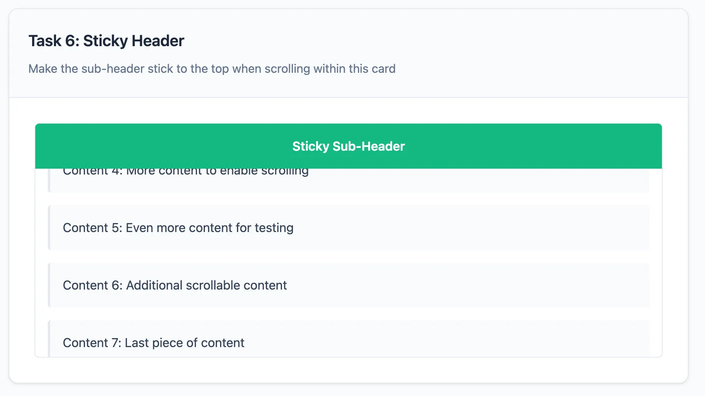 |

|    Task 7: Badge Positioning    |    Task 8: In-Container FAB     |         Task 9: Tooltip         |
| :-----------------------------: | :-----------------------------: | :-----------------------------: |
| 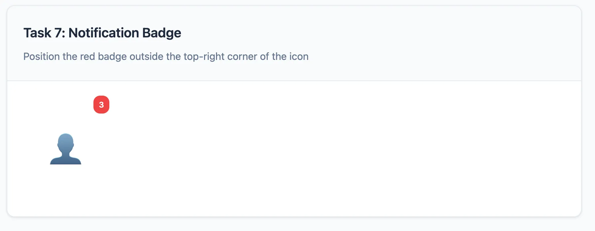 | 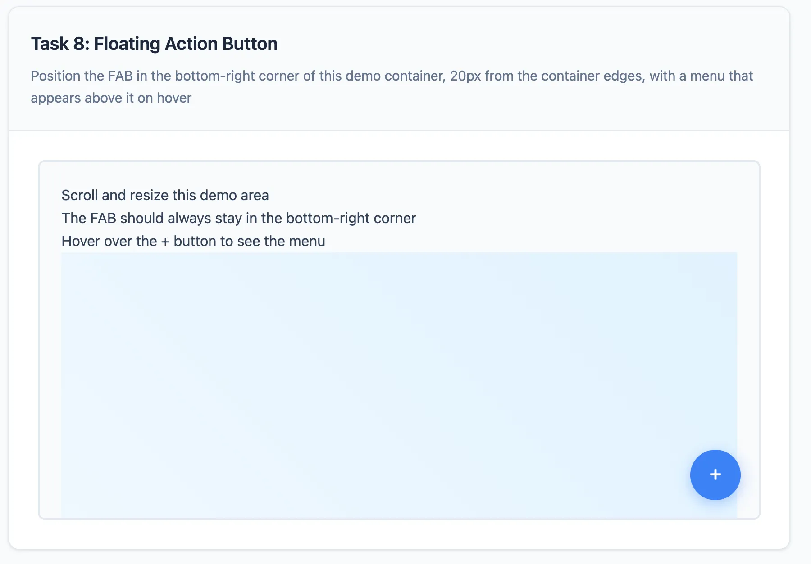 | 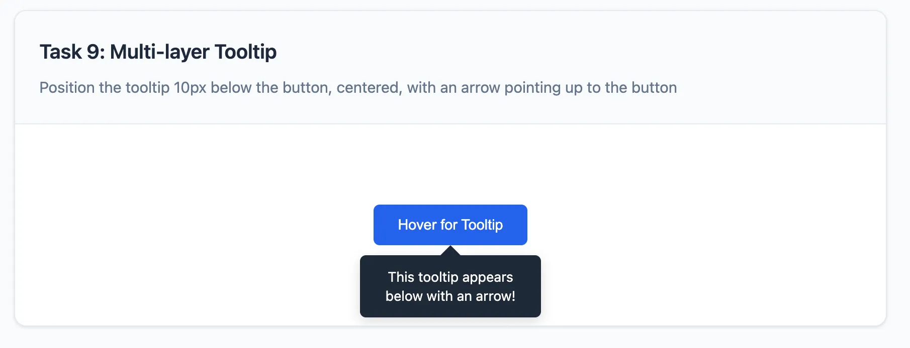 |

|      Task 10: Dropdown Menu      |        Task 11: Page FAB         |  Task 12: Human Figure (Bonus)   |
| :------------------------------: | :------------------------------: | :------------------------------: |
| 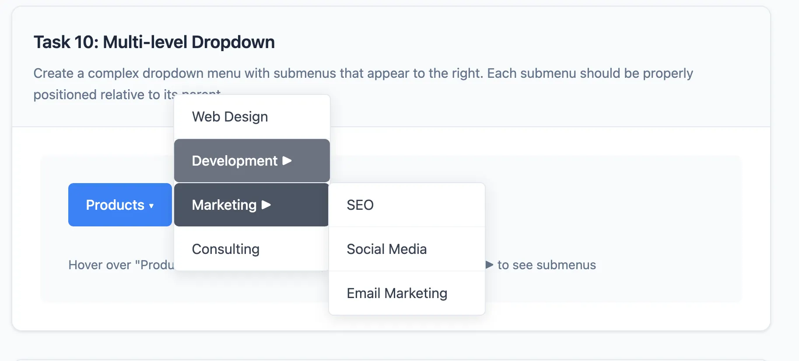 | 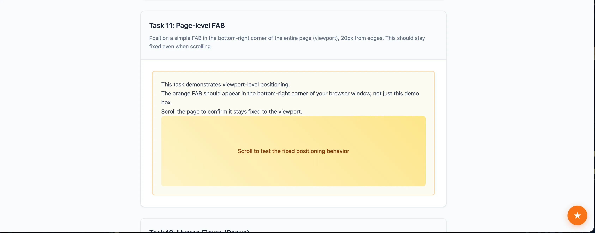 | 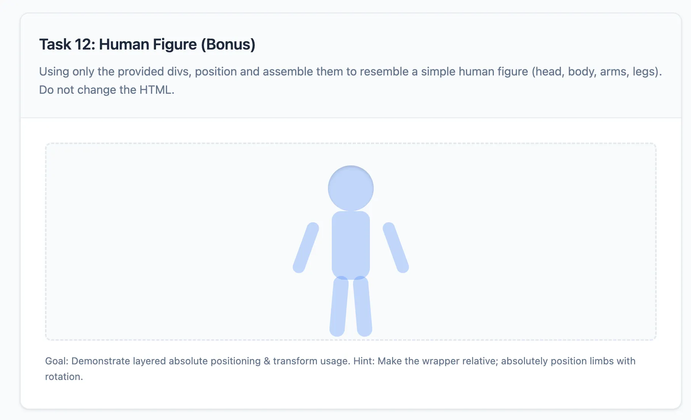 |

---

## 🔧 Rules

- Only edit: `task.css`.
- Do not modify: `index.html`, `base.css`, `solution.css`.
- Keep CSS minimal: only positioning & necessary related props.
- No HTML restructuring, no extra files.

---

## ✅ Workflow

1. Open `index.html` in browser.
2. Implement each task in order in `task.css`.
3. Refresh to verify visually.

Good luck! 🎯
